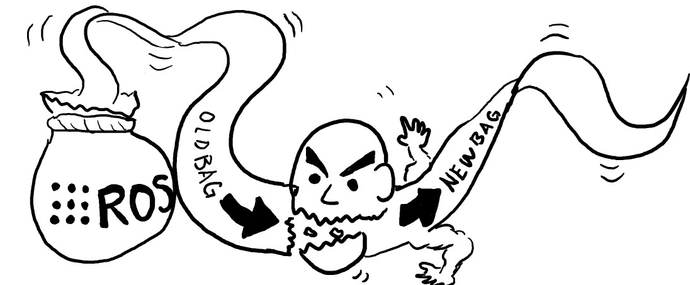

# Bagmetti

<div style="margin: 0 auto">
  
</div>

BAG file utility for MEssage, Tf, and TIme.


## Running

```
rosrun bagmetti filter.py <bag file path> <output file path> <config file path>
```

or simply,

```
filter.py <bag file path> <output file path> <config file path>
```


## Config File Format

Here are some samples to get you started:

```
# gmapping
default: +rule
default: +tf -topic +time

# gmapping does this transformation
-tf: map -> odom
odom
scan
/imu/data
-/velodyne_points
```

A line can start with a `+` or a `-` (or `!`), which indicates whether it
should include or exclude that message (i.e. topic/tf/time).

Following the `+` or `-`, the rule type comes next. A rule type is one of the
following: `topic`, `tf`, or `time`.

Lines starting with `#` are comment lines.

Following is a explanation of the `default` lines. `+rule` or simply `+`, says
that when a line doesn't start with either a `+` or `-`, automatically add `+`
to it. With `-rule`, the default becomes `-` (exclusion). `+tf -topic +time`
says that unspecified TF transformations should be included, topics should be
excluded, and time should be included.

```
default: -
# Do a bunch of exclusions
default: +
# Then switch back to inclusion to do some inclusions
```


### Rule Types

#### Topics

Rule type: `topic` (can be omitted)

```
# Include (since that's the default enforcement) /map topic
/map
# Exclude /velodyne_points
-/velodyne_points
default: -
# Exclude /imu/data and some other stuff
imu/data
trajectory
# Include /scan
+scan
```

However, the exclusion rules in the above configuration file are redundant and
the following results in the same behavior:

```
default: +
map
scan
```


#### TF

Rule type: `tf`

The rule for TF is in the following format:

```
[parent frame][separator][child frame]
```
Separator: `,`, ` ` (space), `->`

For example,

```
+tf: map -> odom
```

will include TF transformations that has `map` as the parent frame ID and
`odom` as the child frame ID. Either of the frame names can be omitted (e.g.
`-tf: map ->` to exclude any TF message that has `map` as the parent name).


#### Time

Rule type: `time`

Specifies the range of the time, starting from the beginning of the bag file.

Follows the same format as TF. For example,

```
+time: 32.2 -> 45
```

will only include messages and transformations published within this time range.

As is the case for TF, either the start time or end time can be omitted.


## License

MIT

## Author

Naoki Mizuno (mizuno.naoki@rm.is.tohoku.ac.jp)
